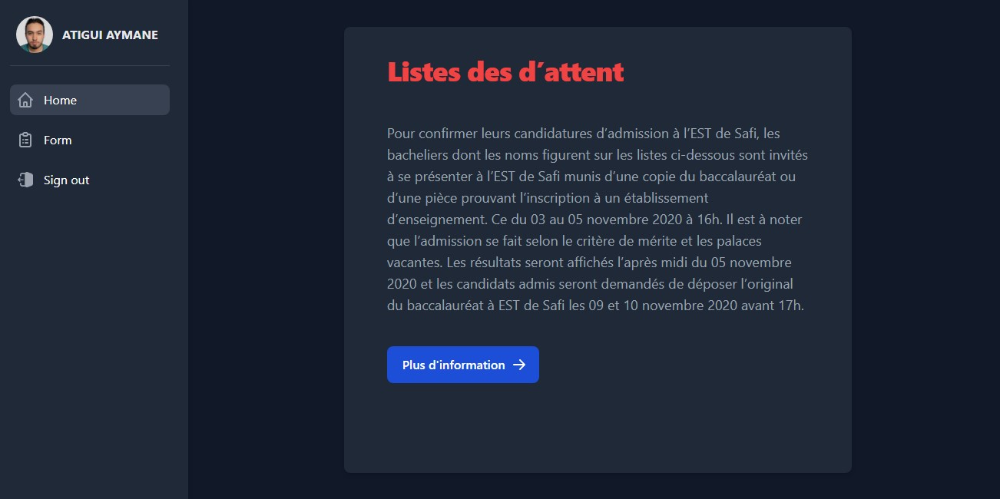
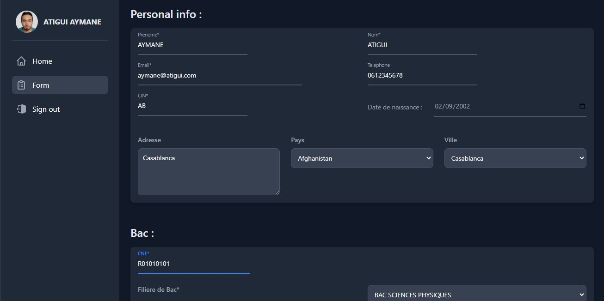
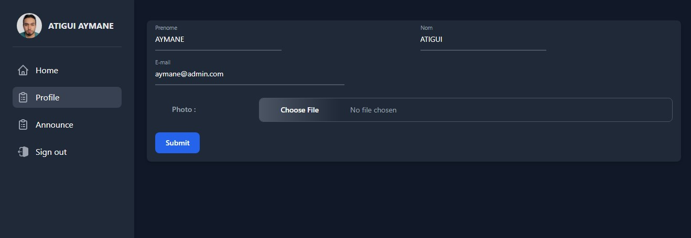
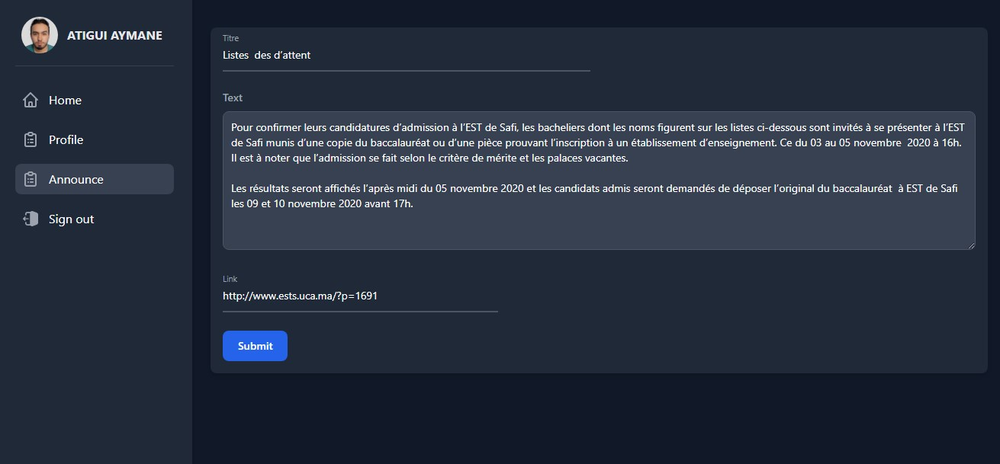
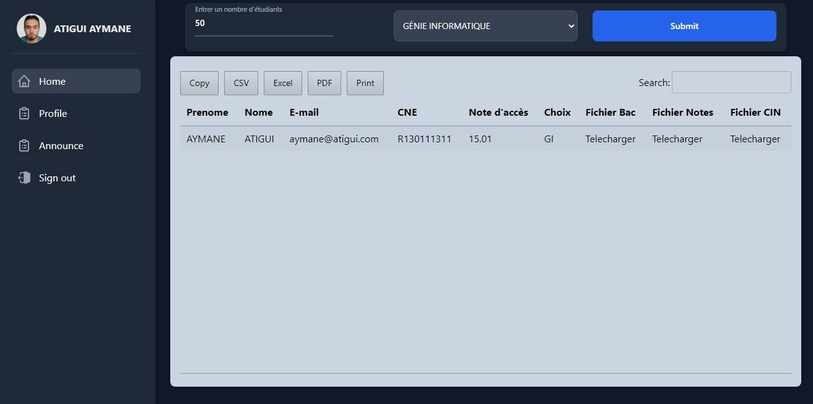

# Preregister
Preregister is a web-based platform designed for new students to pre-register for a specific institution. The platform has two main sections: one for students and the other for the administrator. The student section enables students to create an account using their email and password, after which they can modify their information, upload documents, and view news and announcements posted by the administrator. The administrator section allows the administrator to manage the student database, modify the information displayed to the students, and export data in different formats.

  

## Table of Contents

* [Preregister](#preregister)
* [Table of Contents](#table-of-contents)
* [Installation](#installation)
* [Features](#features)
* [Usage](#usage)
* [Student Section](#student-section)
* [Administrator Section](#administrator-section)
* [Exporting Data](#exporting-data)
* [Conclusion](#conclusion)

## Installation
To install Preregister, follow these steps:

1. Create a database named univ.
2. Import the univ.sql file into the univ database.
3. Clone the repository: git clone https://github.com/username/preregister.git.
4. Navigate to the project directory: cd preregister.
5. Install the project dependencies: npm install.
6. Start the server: npm start.
7. Access the Preregister web application by opening a web browser and going to http://localhost:3000.

## Features

* Easy to use interface for students
* Ability for students to create an account
* Ability for students to modify their information
* Ability for students to upload documents
* Ability to view news and announcements posted by the administrator
* Ability for the administrator to manage the student database
* Ability for the administrator to modify the information displayed to the students
* Ability to export data in different formats

## Usage
After creating an account on the platform, the student is directed to the first interface, where they can log in using their email and password. The platform then verifies the student's information from the database and directs them to their account's first page if the verification is successful. If the verification fails or if there is an error, an error message is displayed.

  

## Student Section
The student's account consists of two main pages. The first page is the home page, which displays the latest news and announcements posted by the administrator. The administrator can modify and add news and announcements to this page. The second page is the registration form, which allows the student to modify their information, upload documents, and view their profile photo. Additionally, there is a button on the account that enables the student to log out.

    
  

## Administrator Section
The administrator's account also consists of two main pages. The first page is the home page, which displays information about all students who have created an account on the platform. The administrator can modify the number of students and the requested choice displayed on this page. The second page is the profile page, which allows the administrator to modify their information, including their name, surname, email, and photo. The administrator can also modify the latest announcements and news that they want to display on the student's home page.

  
  

## Exporting Data
In addition to the two main sections, the platform also supports exporting student data in PDF, CSV, or EXCEL formats. This feature enables the administrator to manage the student database efficiently.

  

## Conclusion
In conclusion, the Preregister platform is an excellent solution for institutions that want to simplify the pre-registration process for new students. The platform's user-friendly interface and the ability to modify and manage the displayed information make it an ideal choice for administrators. Similarly, the platform's registration form and ability to upload documents and photos make it convenient for students to complete the pre-registration process.
